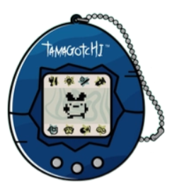

# Legally Distinct Tamagotchi
CST 338 - Project 2: Android Application

## Student Info
* Erika Iwata
* CRN: 23026
* Spring 2023

## Program Description
This is an android application of a tamagotchi clone.

Required Use Cases:
- [X] Predefined Users
- [X] Persistence
- [X] Add a User
- [ ] Delete a User

Additional Use Cases (Based on [User Manual](assets/instructions.png)):
- [ ] Feed
- [ ] Lights
- [ ] Game
- [ ] Sick/Care
- [ ] Bathroom
- [ ] Health
- [ ] Discipline
- [ ] Attention

## Video Demonstration
[Insert Youtube Link]

## Software Engineering
This program was coded entirely in Java using Android Studio.

## Directions and Grading Rubric
Review the following: [Project 2: Android Application](https://docs.google.com/document/d/11b4FGL7AFz1h61ElDy7lOoifnz2GdMy54rca-w9wrMU/edit?usp=sharing)
